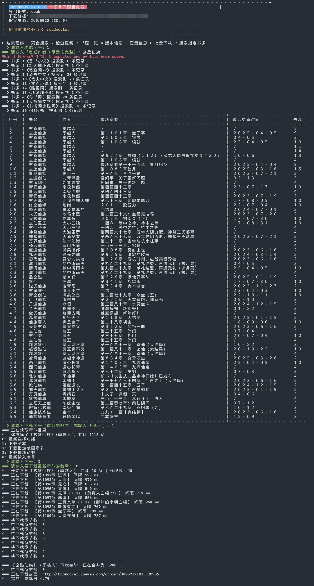

# So Novel

<div align="center">
  
</div>

## 前言

> 国内网上 98% 的 TXT、EPUB
> 格式的网络小说都是完本。如果想看新书，要么去起点等一类的正版平台付费阅读，要么去笔趣阁等一类网站，要么用“阅读(仅限安卓)
> ”等一类
> APP。其实这些方案已经足够很多人使用了，但总会有众口难调的情况：嫌弃 UI
> 的、吐槽功能的、受限于平台的。这时专业电子书阅读器的优势便显现出来了——高度可定制化。
>
> **这款软件能够将全网连载、完本的流行小说免费下载为
> EPUB、TXT
> 等主流电子书格式，以便导入至自己喜爱的阅读器或设备，从而实现电脑、平板、手机的全设备离线阅读。**
>
> 对于完本小说，若出现大量错别字、排版等问题，建议自行去相关平台下载对应精校版。

> [!TIP]
>
> **适合用户 & 适用场景**
>
> 1. 既想免费看正版网文，又想追求绝佳阅读体验的资深书友
> 2. 习惯使用手机阅读的 iOS 用户，由于无法使用 `阅读 APP`，可以使用 `So Novel` 下载到本地后，导入 `Apple Books` 或其它阅读器阅读
> 3. 习惯使用电脑（ Windows、macOS、Linux ）或其它大屏幕设备阅读的用户
> 4. 习惯使用专业电子书阅读器阅读的用户
> 5. 习惯将书籍下载到本地、而非依赖在线阅读的用户
> 6. 需要在无网络环境下离线阅读的用户
> 7. 希望开箱即用（无需任何额外配置即可使用）的用户

## 介绍

交互式小说下载器，Windows、macOS、Linux 解压即用

- 开箱即用 (OOTB)
- [内置多书源](https://github.com/freeok/so-novel/blob/main/BOOK_SOURCES.md)
- 导出格式：EPUB、TXT、HTML (支持翻页)、PDF
- 极速下载 (仅针对无限流书源)
- 聚合搜索 (无需逐一切换书源)
- 批量下载
- 簡繁互转

> [!IMPORTANT]
>
> 本项目秉承“**各司其职，各尽其能**”的设计理念，专注于做好下载这一核心功能，暂不集成阅读器等非必要模块，力求简洁高效。
>
> 下载后，导入专业的电子书阅读器，即可开始畅读

*结合以下阅读器使用，体验更佳*

电脑：[Readest](https://readest.com/)、[Koodo Reader](https://www.koodoreader.com/zh)、[Calibre](https://calibre-ebook.com/)、[Neat Reader (网页版)](https://www.neat-reader.cn/webapp)

手机：[Readest](https://readest.com/)、[Apple Books](https://www.apple.com/apple-books/)、[Moon+ Reader (静读天下)](https://moondownload.com/chinese.html)、[Kindle](https://apps.apple.com/us/app/amazon-kindle/id302584613)、<del>
微信读书</del>（2024.4 更新后，非付费会员每月最多导 3 本书）

> [!WARNING]
>
> iOS 16 Apple Books 目录不能定位到当前章节，如果看到很多章了，就需要从上一直向下划，十分不便（iOS 17 修复了此 Bug）
>
> Apple Books 不建议开启 iCloud，因为每次打开都要从 iCloud 重新下载且速度很慢

## 预览

保留部分下载日志



## 使用

### 📦 普通安装

1. 下载最新版 https://github.com/freeok/so-novel/releases
2. 根据 [readme.txt](bundle%2Freadme.txt) 使用

### 🍨 Scoop 安装

```bash
scoop bucket add freeok https://github.com/freeok/scoop-bucket
scoop install freeok/so-novel
```

### 🍺 Homebrew 安装

```bash
brew tap ownia/homebrew-ownia
brew install so-novel
```

### 🐳 Docker 安装

```bash
curl -sSL https://raw.githubusercontent.com/freeok/so-novel/main/bin/docker-install-sonovel.sh | bash
```

> [!NOTE]
>
> 许多书源会屏蔽国外 IP，需关闭代理后使用
>
> 由于书源域名会变动，旧版可能无法使用，请使用最新版
>
> 如需其它电子书格式，请使用 [Calibre](https://calibre-ebook.com/zh_CN) 或 [Convertio](https://convertio.co/zh/) 自行转换！
>
> 若最新版的某个书源无法使用，请 New issue，将尽快修复
>
> 欢迎[推荐优质书源](https://github.com/freeok/so-novel/issues/new?template=recommend-source.yml)！

## 常见问题

[点击查看](https://github.com/freeok/so-novel/issues?q=is:issue%20state:closed%20label:%22user%20error%22)

## 支持

*本项目纯粹为爱发电⚡，坚持无偿更新🔥*

*开源不易，如果觉得有所帮助，欢迎点击顶部右上角的 ⭐Star
支持！🚀这将是我们持续更新的动力源泉！同时，你也能第一时间获取到最新的更新动态。💡❤️*

## Star History

[](https://star-history.com/#freeok/so-novel&Date)