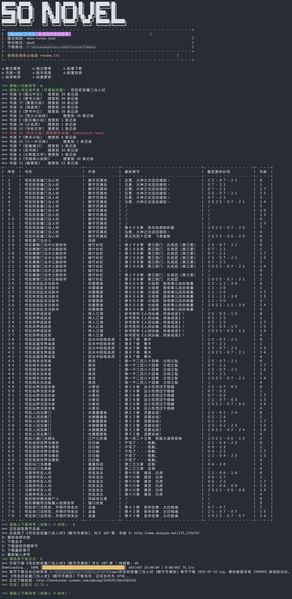
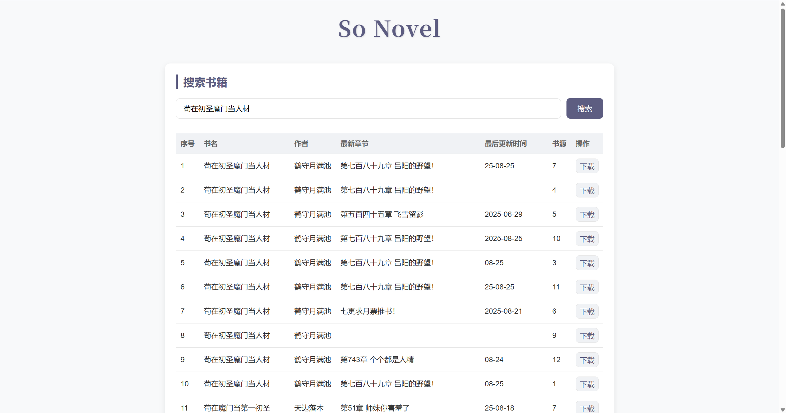
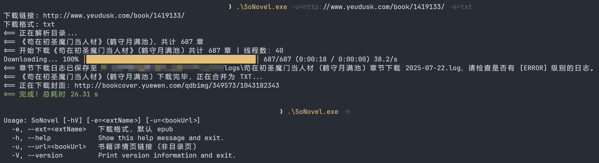
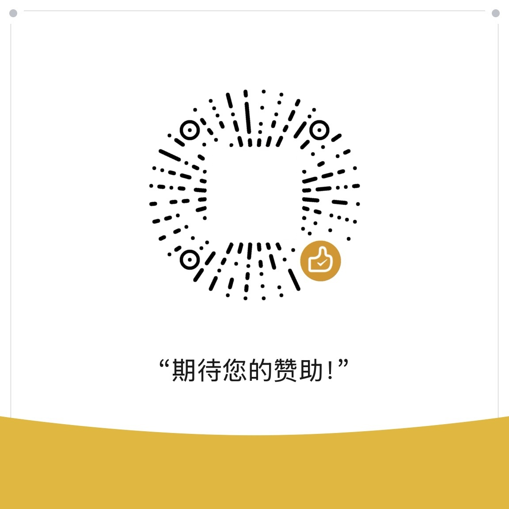

# So Novel

<div align="center">
  
</div>

## 概述

**So Novel** 是一款通用的网页内容处理与导出工具，它致力于帮助用户高效地从网页中提取结构化信息，并将其灵活导出为
EPUB、TXT、PDF 等多种标准电子文档格式。适用于学习采集、格式转换、电子书制作等场景。

## TUI 预览 (Text-based User Interface)



## WebUI 预览 (网页版)



## CLI 预览 (Command Line Interface)



## 使用

### 📦 普通安装

1. 下载最新版 https://github.com/freeok/so-novel/releases
2. 根据 [readme.txt](bundle%2Freadme.txt) 使用

### 🍨 Scoop 安装

```bash
scoop bucket add freeok https://github.com/freeok/scoop-bucket
scoop install freeok/so-novel
```

### 🍺 Homebrew 安装

```bash
brew tap ownia/homebrew-ownia
brew install so-novel
```

### 🐧 Linux 安装

```bash
bash <(curl -sSL https://raw.githubusercontent.com/freeok/so-novel/main/bin/linux-install.sh)
```

### 🐳 Docker 安装

```bash
curl -sSL https://raw.githubusercontent.com/freeok/so-novel/main/bin/docker-install.sh | bash
```

> [!TIP]
>
> 如需其它电子书格式，请使用 [Calibre](https://calibre-ebook.com/zh_CN) 或 [Convertio](https://convertio.co/zh/) 自行转换！
>
> 推荐使用以下阅读器
>
> 桌面端：[Readest](https://readest.com/)、[Koodo Reader](https://www.koodoreader.com/zh)、[Calibre](https://calibre-ebook.com/)、[Neat Reader (网页版)](https://www.neat-reader.cn/webapp)
>
> 移动端：[Readest](https://readest.com/)、[Apple Books](https://www.apple.com/apple-books/)、[Moon+ Reader (静读天下)](https://moondownload.com/chinese.html)、[Kindle](https://apps.apple.com/us/app/amazon-kindle/id302584613)

## 常见问题

https://github.com/freeok/so-novel/issues?q=label%3A%22usage%20question%22

## 讨论

https://github.com/freeok/so-novel/discussions?discussions_q=

## 支持

如果觉得有所帮助，欢迎扫码赞赏☕，或点击顶部的⭐Star
按钮支持！🚀这将是我们持续更新的动力源泉！同时，你也能第一时间获取到最新的更新动态。💡❤️

| 支付宝赞赏                                                           | 微信赞赏                                                           |
|-----------------------------------------------------------------|----------------------------------------------------------------|
|  |  |

## 免责声明

在使用本工具前，请务必仔细阅读我们的[法律免责声明](bundle/DISCLAIMER.md)。使用本工具即表示您已阅读、理解并同意遵守所有条款。

## Star History

[](https://star-history.com/#freeok/so-novel&Date)