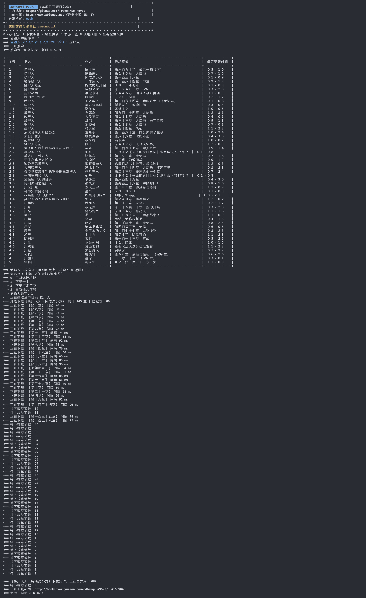

# So Novel

<div align="center">
  
</div>

## 前言

适合用户：既想免费看正版付费新书，又追求更佳阅读体验的网络文学爱好者。

适用场景：国内网上 98% 的 TXT 、EPUB 等格式的小说都是完本。如果想看新书，要么去起点等一类的正版平台付费阅读，要么去笔趣阁等一类网站，要么用“阅读”（仅限安卓）等一类
APP。其实这些方案足够很多人用了，但总会有众口难调的情况：嫌弃 UI
难看的、吐槽功能的、受限于平台的。这时阅读器的优势便显现出来了——DIY。这个工具最大的意义就是能把连载的新书免费下载为 EPUB
等电子书格式，从而导入自己喜爱的阅读器。

对于完本小说，本工具同样可以搜索下载。若出现错别字、排版等问题，建议自行搜索下载对应精校版。

## 介绍

交互式小说下载器，Windows、macOS、Linux 解压即用

可根据书名、作者搜索并下载小说

支持导出格式：EPUB、TXT、HTML（支持翻页）

结合以下电子书阅读器使用更佳

- 电脑：[Koodo Reader](https://www.koodoreader.com/zh)、[Readest](https://github.com/readest/readest)
- 手机：[Apple Books](https://www.apple.com/apple-books/)、[Moon+ Reader](https://moondownload.com/chinese.html)、<del>
  微信读书</del>（2024.4 更新后非付费会员每月最多导 3 本书）

> [!WARNING]
>
> iOS 16 Apple Books 目录不能定位到当前章节，如果看到很多章了，就需要从上一直向下划，十分不便
>
> iOS 17 修复了此 Bug

## 效果

保留部分下载日志



## 使用

### 普通安装

1. 下载最新版 https://github.com/freeok/so-novel/releases
2. 根据 [readme.txt](input%2Freadme.txt) 使用

### 🍨 Scoop 安装

```bash
scoop bucket add spc https://gh.idayer.com/github.com/lzwme/scoop-proxy-cn
scoop install so-novel
```

### 🍺 Homebrew 安装

```bash
brew tap ownia/homebrew-ownia
brew install so-novel
```

> [!TIP]
>
> 许多书源会屏蔽国外 IP，需关闭代理后使用
>
> 由于书源 URL 会变动，旧版可能无法使用，请使用最新版
>
> 若最新版的书源无法使用，请 New issue，将尽快修复
>
> 欢迎在 issue 推荐高质量书源（无需点击“确认您是真人”、能搜到[起点人气榜单](https://www.qidian.com/rank/)的书、错别字少、排版不错乱）

## 常见问题

[点击查看](https://github.com/freeok/so-novel/issues?q=is:issue%20state:closed%20label:%22user%20error%22)

## Star History

本项目纯粹为爱发电⚡，持续无偿更新。

如果觉得有所帮助，欢迎点击顶部右上角的 ⭐Star 支持！🚀这是我们持续更新的最大动力！💡❤️

[](https://star-history.com/#freeok/so-novel&Date)