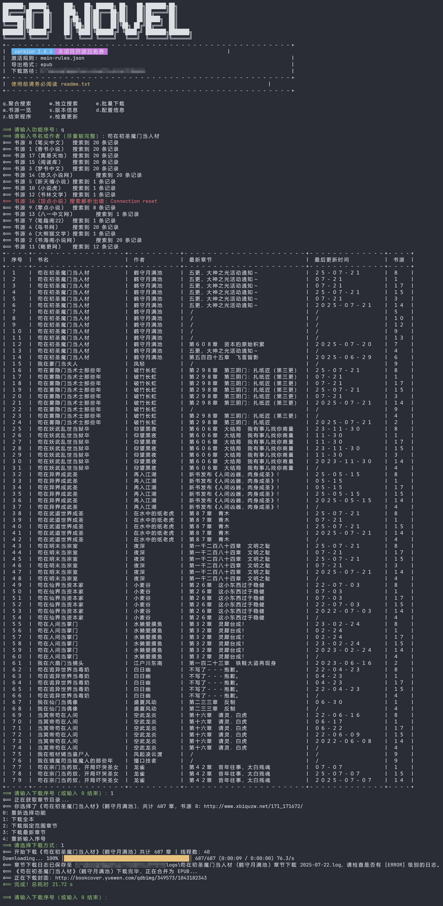
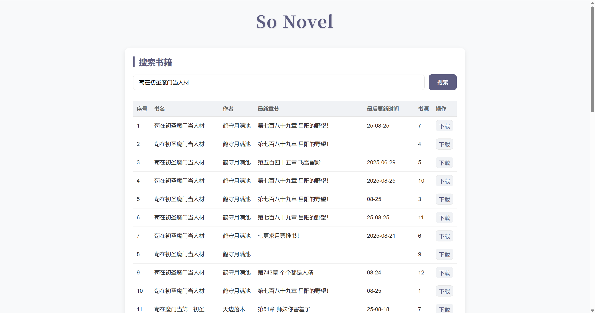
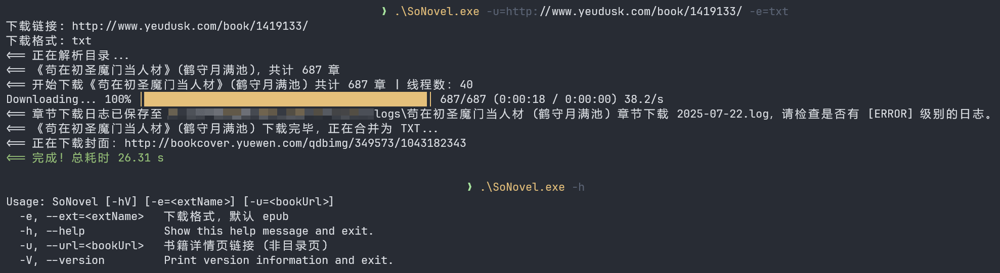

<div align="center">
  
  <h1 align="center">So Novel</h1>
  <h4 align="center"></h4>
</div>

<div align="center">

[![zread](https://img.shields.io/badge/Ask_Zread-_.svg?style=flat&color=00b0aa&labelColor=000000&logo=data%3Aimage%2Fsvg%2Bxml%3Bbase64%2CPHN2ZyB3aWR0aD0iMTYiIGhlaWdodD0iMTYiIHZpZXdCb3g9IjAgMCAxNiAxNiIgZmlsbD0ibm9uZSIgeG1sbnM9Imh0dHA6Ly93d3cudzMub3JnLzIwMDAvc3ZnIj4KPHBhdGggZD0iTTQuOTYxNTYgMS42MDAxSDIuMjQxNTZDMS44ODgxIDEuNjAwMSAxLjYwMTU2IDEuODg2NjQgMS42MDE1NiAyLjI0MDFWNC45NjAxQzEuNjAxNTYgNS4zMTM1NiAxLjg4ODEgNS42MDAxIDIuMjQxNTYgNS42MDAxSDQuOTYxNTZDNS4zMTUwMiA1LjYwMDEgNS42MDE1NiA1LjMxMzU2IDUuNjAxNTYgNC45NjAxVjIuMjQwMUM1LjYwMTU2IDEuODg2NjQgNS4zMTUwMiAxLjYwMDEgNC45NjE1NiAxLjYwMDFaIiBmaWxsPSIjZmZmIi8%2BCjxwYXRoIGQ9Ik00Ljk2MTU2IDEwLjM5OTlIMi4yNDE1NkMxLjg4ODEgMTAuMzk5OSAxLjYwMTU2IDEwLjY4NjQgMS42MDE1NiAxMS4wMzk5VjEzLjc1OTlDMS42MDE1NiAxNC4xMTM0IDEuODg4MSAxNC4zOTk5IDIuMjQxNTYgMTQuMzk5OUg0Ljk2MTU2QzUuMzE1MDIgMTQuMzk5OSA1LjYwMTU2IDE0LjExMzQgNS42MDE1NiAxMy43NTk5VjExLjAzOTlDNS42MDE1NiAxMC42ODY0IDUuMzE1MDIgMTAuMzk5OSA0Ljk2MTU2IDEwLjM5OTlaIiBmaWxsPSIjZmZmIi8%2BCjxwYXRoIGQ9Ik0xMy43NTg0IDEuNjAwMUgxMS4wMzg0QzEwLjY4NSAxLjYwMDEgMTAuMzk4NCAxLjg4NjY0IDEwLjM5ODQgMi4yNDAxVjQuOTYwMUMxMC4zOTg0IDUuMzEzNTYgMTAuNjg1IDUuNjAwMSAxMS4wMzg0IDUuNjAwMUgxMy43NTg0QzE0LjExMTkgNS42MDAxIDE0LjM5ODQgNS4zMTM1NiAxNC4zOTg0IDQuOTYwMVYyLjI0MDFDMTQuMzk4NCAxLjg4NjY0IDE0LjExMTkgMS42MDAxIDEzLjc1ODQgMS42MDAxWiIgZmlsbD0iI2ZmZiIvPgo8cGF0aCBkPSJNNCAxMkwxMiA0TDQgMTJaIiBmaWxsPSIjZmZmIi8%2BCjxwYXRoIGQ9Ik00IDEyTDEyIDQiIHN0cm9rZT0iI2ZmZiIgc3Ryb2tlLXdpZHRoPSIxLjUiIHN0cm9rZS1saW5lY2FwPSJyb3VuZCIvPgo8L3N2Zz4K&logoColor=ffffff)](https://zread.ai/freeok/so-novel)
[](https://github.com/freeok/so-novel/blob/main/LICENSE)
[](https://github.com/freeok/so-novel/releases/latest)
[](https://github.com/freeok/so-novel/releases/latest)

</div>

## 概述

**So Novel** 是一款通用的网页内容处理与导出工具，它致力于帮助用户高效地从网页中提取结构化信息，并将其灵活导出为
EPUB、TXT、PDF 等多种标准电子文档格式。适用于学习采集、格式转换、电子书制作等场景。

## 预览

<details>
  <summary>点击查看图片</summary>

### TUI 预览 (Text-based User Interface)



### WebUI 预览 (网页版)



### CLI 预览 (Command Line Interface)



</details>

## 使用

### 📦 普通安装

1. 下载最新版 https://github.com/freeok/so-novel/releases
2. 根据 [readme.txt](bundle%2Freadme.txt) 使用

### 🍨 Scoop

```bash
scoop bucket add freeok https://github.com/freeok/scoop-bucket
scoop install freeok/so-novel
```

### 🍺 Homebrew

```bash
brew tap ownia/homebrew-ownia
brew install so-novel
```

### 🐧 Linux

```bash
bash <(curl -sSL https://raw.githubusercontent.com/freeok/so-novel/main/bin/linux-install.sh)
```

### 🐳 Docker

**方式 1：脚本一键安装**

```bash
curl -sSL https://raw.githubusercontent.com/freeok/so-novel/main/bin/docker-install.sh | bash
```

**方式 2：Docker Compose**

```yaml
services:
  sonovel:
    image: ghcr.io/freeok/sonovel:latest
    container_name: sonovel
    ports:
      - "7765:7765"
    environment:
      JAVA_OPTS: "-Dmode=web"
    volumes:
      - sonovel_data:/sonovel
    restart: unless-stopped

volumes:
  sonovel_data:
```

**方式 3：直接运行容器**

```bash
# 如需挂载，请提前准备好 config.ini 文件、rules 目录
docker run -d \
  --name sonovel \
  -v /sonovel/config.ini:/sonovel/config.ini \
  -v /sonovel/rules:/sonovel/rules \
  -v /sonovel/downloads:/sonovel/downloads \
  -p 7765:7765 \
  -e JAVA_OPTS='-Dmode=web' \
  ghcr.io/freeok/sonovel:latest
```

**方式 4：从源码构建镜像**

```bash
# 确保已安装 git、maven
# arch: [x64|arm64]

# 构建项目
git clone https://github.com/freeok/so-novel.git && cd so-novel
sh bin/release-linux.sh [arch]

# 构建 Docker 镜像
cp -r target/sonovel-linux_[arch]/{app.jar,config.ini,rules} .
docker build -t sonovel .
```

> [!TIP]
>
> 为获得最佳阅读体验，建议使用以下电子书阅读器：
>
> **桌面端**
>
> - [Readest](https://readest.com/)
> - [Koodo Reader](https://www.koodoreader.com/zh)
> - [Calibre](https://calibre-ebook.com/)
> - [Neat Reader（网页版）](https://www.neat-reader.cn/webapp)
>
> **移动端**
>
> - [Readest](https://readest.com/)
> - [Apple Books](https://www.apple.com/apple-books/)
> - [Moon+ Reader（静读天下）](https://moondownload.com/chinese.html)
> - [Kindle](https://apps.apple.com/us/app/amazon-kindle/id302584613)
>
> 如需转换为其它电子书格式，可使用：
>
> - [FreeConvert](https://www.freeconvert.com/zh)
> - [Calibre](https://calibre-ebook.com/zh_CN)
> 
> 修复 WPS、掌阅等软件无法打开 so-novel 下载的 EPUB：https://github.com/freeok/so-novel/discussions/199

## 自定义 JVM 系统属性

| 参数            | 说明                     | 默认值          |
|---------------|------------------------|--------------|
| -Dconfig.file | 配置文件路径                 | ./config.ini |
| -Dmode        | 启动模式，可选值：tui\|cli\|web | tui          |

用法

> [!NOTE]
>
> Windows 修改 [sonovel.l4j.ini](bundle/sonovel.l4j.ini)
>
> Linux 修改  [run-linux.sh](bundle/run-linux.sh)
>
> macOS 修改  [run-macos.sh](bundle/run-macos.sh)

## 使用本地 JDK / JRE 启动

如果你不想使用内置 JRE（runtime 目录），可以通过本地 JDK / JRE 启动程序

Windows 使用脚本 start-custom-jre.cmd：

```cmd
REM --------------------------------------------------
REM 高级用户使用自定义 JRE 启动程序
REM 将 "your_path\java.exe" 替换为你的 JRE 路径，例如：
REM "C:\Java\jdk-21\bin\java.exe"
REM --------------------------------------------------
@echo off
your_path\java.exe ^
  -XX:+UseZGC ^
  -XX:+ZGenerational ^
  -Dconfig.file=config.ini ^
  -Dmode=tui ^
  -Dfile.encoding=GBK|Big5 ^
  -jar app.jar
```

Linux / macOS：[run-linux.sh](bundle/run-linux.sh) / [run-macos.sh](bundle/run-macos.sh) 修改 java 路径

## 常见问题

https://github.com/freeok/so-novel/issues?q=label%3A%22usage%20question%22

## 讨论

https://github.com/freeok/so-novel/discussions?discussions_q=

## 支持 & 赞助

如果觉得有所帮助，欢迎扫码赞助☕、点击项目主页顶部的⭐Star 按钮支持！

🚀这将是我们持续更新的动力源泉！同时，你也能第一时间获取到最新的更新动态。💡❤️

| 支付宝赞助                                                           | 微信赞助                                                           |
|-----------------------------------------------------------------|----------------------------------------------------------------|
|  |  |

[项目赞助者列表](./SPONSORS.md)

## 免责声明

在使用本工具前，请务必仔细阅读我们的[法律免责声明](bundle/DISCLAIMER.md)。使用本工具即表示您已阅读、理解并同意遵守所有条款。

## Star History

[](https://star-history.com/#freeok/so-novel&Date)